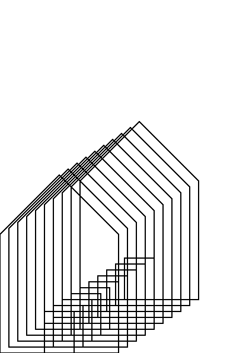
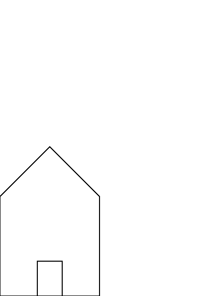

# Procedures


In the exercises you found the oppertunity to draw a house. An example of a house can be seen below



The image that opens this chapter is based on the above house. The naive way to create the opening image is to repeat the code and change the relevant parameters.

Although feasable, this is repetative, error-prone and not much fun. We would rather create a procedure that does the work for us.

## Deferred Execution
There is an interesting aspect to creating a procedures in PostScript or, for that matter, any interpreted language.

Take for example the `add` operator. The operator `add` takes two operands from the stack, adds them together and puts the result back onto the stack. But if we are creating a procedure, that should not happen when we are creating the procedure. It should happen when we execute the procudure. It should defer the execution until the procedure is called.

Too signal to the PostScript interpreter to defer the execution of operators is with the opening brace: `{`.

This is akin to C-style languages, but it does play a different role here.

With a little imagination one could guess that to finish defining a procedure one uses the closing brace: `}`.

## Venerable "Hello, World!"-example
Let's hark back to the PostScript variant of the "Hello, World!"-program. There we created a line. If we wanted to create a procedure for that we could do that in the following way.

I have opened a REPL in order to better explore how PostScript handles procedures. When I go and type in the following code into the REPL

```
GS>{
    0 0 moveto
    100 100 lineto
}
```

The PostScript interpreter responds with 

```
GS<1>
```

Indicating that there is something on the operand stack. Using `pstack` to show the contents of the operand stack, PostScript echos back the definition of the procedure.

```
GS<1>pstack
{0 0 moveto 100 100 lineto}
```

With a procedure at the top of the stack, we can execute it with the `exec` operator. This is a novelty operator that we probably will use sparingly, but it get's the job done.

```
GS<1>exec
```

Remember, the only thing that will happen is that the current path is extended. Not until we stroke the path will anything become visible.

```
GS>stroke
```

The entire transcript of the REPL run is found below.

```
GPL Ghostscript 9.50 (2019-10-15)
Copyright (C) 2019 Artifex Software, Inc.  All rights reserved.
This software is supplied under the GNU AGPLv3 and comes with NO WARRANTY:
see the file COPYING for details.
GS>{
0 0 moveto
100 100 lineto
}
GS<1>pstack
{0 0 moveto 100 100 lineto}
GS<1>exec
GS>stroke
GS>
```

## Binding Procedures
Defining procedures and immediatly executing them with the `exec` operator kind of defies the purpose. Instead we can bind the procedure to a name so we can reuse it later on.

We can bind the above procedure to a key `/segment` with the following code.

```ps
/segment {
    0 0 moveto
    100 100 lineto
} def
```

Later on we can call it with by looking up the name

```ps
segment
```

If you would execute that in a REPL, you would notice that it does not leave anything on the stack. Instead, when PostScript notices that a bound value is _executable_ it goes ahead and executes it!

## Variables
By now you have seen numerous usages of the stack in PostScript. With a leap of imagination you could come up with a mechanism how to pass arguments to procedures; place them on the stack. See the exercises for an suggestion how that could work.


## Exercises
1. The `segment` procedure can draw only one segment; the one from `0 0` to `100 100`. Change the definition of segment to accept arguments via the stack. The following program fragment should draw three lines

```ps
/segment {
    % your definition here
} def

0 0 50 100 segment
0 0 100 100 segment
0 0 150 100 segment
stroke
```

2. In your implementation of `0 0 100 100 segment` is the line drawn from `0 0` to `100 100`, or the other way around? For a single segment it does not make a huge difference. But when we are creating longer paths it might. Write an implementation of segment that draws the line in the opposite direction.
3. If you haven't already, try to bind the arguments for the segment procedure to names and use them. 
4. Take a look at your house and write a procedure that can reproduce the house.
