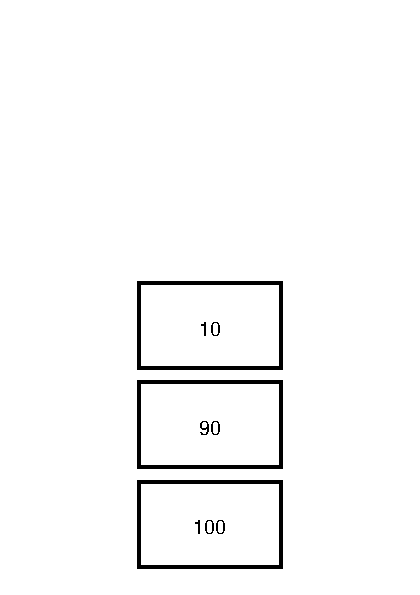
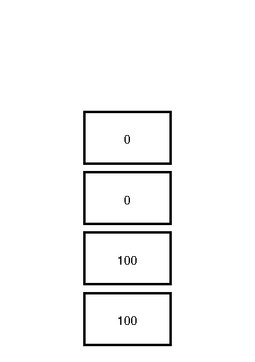
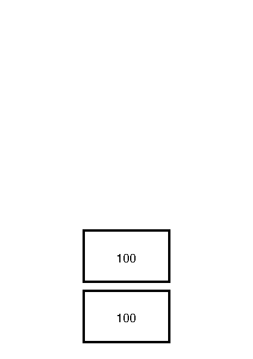
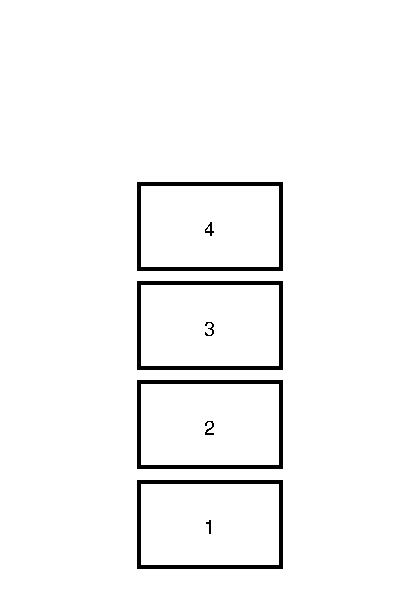

# Stack
I would like to revisit the "Hello, World!"-program to highlight an important point. For completeness, here is the source of the "Hello, World!"-program that draws a line on the page.

```ps
{{#include ../../image-src/hello-world.ps:2:4}}
```

A different program that produces the exact same output is shown next

```ps
{{#include ../../image-src/hello-world.alternative.ps:2:5}}
```

How can this be?

## Operators
In the last chapter we have called `moveto` a command. The name that PostScript uses is _operator_.

An operator is a functionality that PostScript provides. We have seen examples like `newpath`, `moveto`, `lineto` and `stroke`. Some operators need data to operate correctly. PostScript calls the necessary data _operands_. You can think of them as arguments to the operator.

## Operand Stack
Operands to operators are taken from the _operand stack_. A [stack][wikipedia:stack] is

> an abstract data type that serves as a collection of elements, with two main principal operations:
>
> * `Push`, which adds an element to the collection, and
> * `Pop`, which removes the most recently added element that was not yet removed.

Below we can see a stack with two items, `100` and `90`.


The item `100` is said to be on the bottom of the stack, the item `90` is said to be on the top of the stack. When one _pushes_ the item `10` on the stack, the stack grows upward.



## Value
When the PostScript interpreter encounters a value, like `100`, `90` or `10`, it will push it on the operand stack. So the first part of the alternative "Hello, World!"-program

```ps
{{#include ../../image-src/hello-world.alternative.ps:2:2}}
```

Will push the values `100`, `100`, `0` and `0` on the operand stack. Resulting in a stack that looks like this



## Operator
When the PostScript interpreter encounters an operator it will execute it. If an operator needs operands to operate, it will take does from the operand stack.

For example, the `moveto` operator expects two operands. It will pop does from the operand stack.

```ps
{{#include ../../image-src/hello-world.alternative.ps:2:3}}
```

So the above program will result in an operand stack similar too



It leaves two operands for the `lineto` operator to consume.

## Stackunderflow
When the PostScript interpreter encounters an operator, but the necessary operands aren't on the stack, an _stackunderflow_ error is issued.

For example, when ones starts a GhostScript session and immediatly perform `moveto`

```
GS> moveto
```

One is greeted with a 

```
Error: /stackunderflow in --moveto--
Operand stack:

Execution stack:
   %interp_exit   .runexec2   --nostringval--   --nostringval--   --nostringval--   2   %stopped_push   --nostringval--   --nostringval--   %loop_continue   --nostringval--   --nostringval--   false   1   %stopped_push   .runexec2   --nostringval--   --nostringval--   --nostringval--   2   %stopped_push   --nostringval--
Dictionary stack:
   --dict:727/1123(ro)(G)--   --dict:0/20(G)--   --dict:75/200(L)--
Current allocation mode is local
Last OS error: Resource temporarily unavailable
Current file position is 7
```

While developing PostScript programs one often encounters these kind of errors.

## Exercises
1. For each of the following program fragments, draw the resuling operand stack.

```ps
{{#include ../../image-src/cross.alternative.ps:2:2}}
```

```ps
{{#include ../../image-src/cross.alternative.ps:2:4}}
```

```ps
{{#include ../../image-src/cross.alternative.ps:2:6}}
```

```ps
{{#include ../../image-src/cross.alternative.ps:2:7}}
```

```ps
{{#include ../../image-src/cross.alternative.ps:2:9}}
```

What does the last program look like when printed?

2. Write a program that results in an operand stack like this



3. Is it always possible to write programs that first pushes all the operands on the stack before executing operators?

[wikipedia:stack]: https://en.wikipedia.org/wiki/Stack_%28abstract_data_type%29
